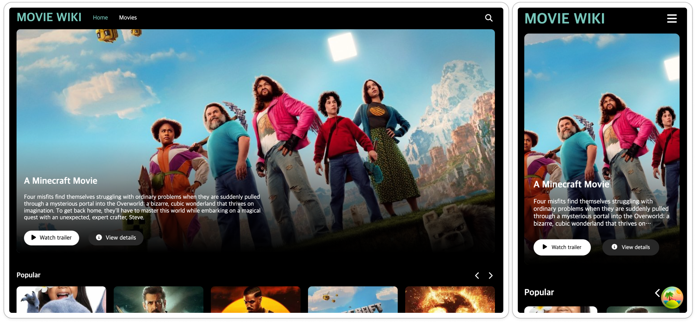
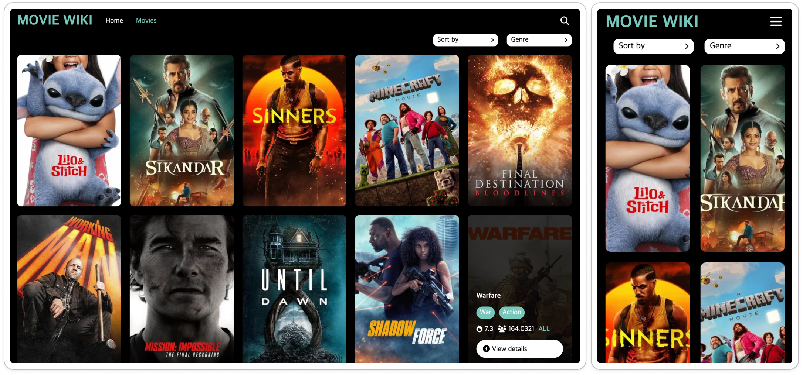

# MOVIE WIKI

TMDB API를 활용한 영화 정보 웹 페이지입니다.



- Demo : https://movie-wiki-six.vercel.app/

### 개발 목표

실무에서 자주 사용하는 기술 스택을 활용해 실제 서비스 형태의 프로젝트를 구현하는 것을 목표로 하였습니다.  
TanStack Query, Swiper, React Suspense 등 다양한 라이브러리를 사용하며 컴포넌트 구조화, 에러 핸들링, 반응형 UI 구현 등 실무와 유사한 개발 흐름을 경험하고자 했습니다.

### 사용 기술

- React
- React Router
- TanStack Query
- CSS Module
- Swiper
- React Suspense
- react-error-boundary
- react-intersection-observer

### Advanced Feature

- TanStack Query와 react-intersection-observer를 활용한 무한 스크롤 구현



```javascript
import { useInfiniteQuery } from '@tanstack/react-query';
import api from '../utils/api';

const fetchMovieSearch = (keyword, sortBy, genreId, page) => {
  const params = new URLSearchParams();

  params.append('page', page);

  const isDefault = sortBy === 'Sort by' && !genreId && (!keyword || keyword.trim() === '');

  if (isDefault) {
    return api.get(`/movie/popular?${params.toString()}`);
  }

  if (sortBy !== 'Sort by') {
    params.append('sort_by', sortBy);
  }

  if (genreId) {
    params.append('with_genres', genreId);
  }

  if (keyword) {
    params.append('with_text_query', keyword);
  }

  return api.get(`/discover/movie?${params.toString()}`);
};

export const useMovieSearchQuery = (keyword, sortBy, genreId) => {
  return useInfiniteQuery({
    queryKey: ['movie-search', keyword, sortBy, genreId],
    queryFn: ({ pageParam }) => fetchMovieSearch(keyword, sortBy, genreId, pageParam),
    getNextPageParam: ({ data }) => {
      if (data.page < Math.min(data.total_pages, 500)) {
        return data.page + 1;
      }

      return undefined;
    },
    initialPageParam: 1,
  });
};
```

```javascript
import styles from './MoviesPage.module.css';
import { useSearchParams } from 'react-router';
import { useMovieSearchQuery } from '../../hooks/useMovieSearchQuery';
import MovieCard from '../../common/components/MovieCard/MovieCard';
import { useEffect, useState } from 'react';
import { useInView } from 'react-intersection-observer';
import Loading from '../../common/components/Loading/Loading';
import Dropdown from './components/Dropdown/Dropdown';
import { useMovieGenreQuery } from '../../hooks/useMovieGenreQuery';

const MoviesPage = () => {
  const [currentSort, setCurrentSort] = useState('Sort by');
  const [currentGenre, setCurrentGenre] = useState('Genre');

  const [query, setQuery] = useSearchParams();
  const keyword = query.get('q');

  const { data: genreData } = useMovieGenreQuery();

  const sortData = [
    { id: 1, name: 'popularity.desc' },
    { id: 2, name: 'popularity.asc' },
  ];

  const genre = genreData?.find((item) => item.name === currentGenre);

  const { data, isLoading, fetchNextPage, hasNextPage, isFetchingNextPage } = useMovieSearchQuery(
    keyword,
    currentSort,
    genre?.id
  );

  const { ref, inView } = useInView();

  useEffect(() => {
    if (inView && hasNextPage && !isFetchingNextPage) {
      fetchNextPage();
    }
  }, [inView]);

  if (isLoading) {
    return <Loading />;
  }

  return (
    <div className={styles['movies-page']}>
      <div className={styles['movies-page__filters']}>
        <Dropdown
          currentOption={currentSort}
          options={sortData}
          onSelect={(e) => setCurrentSort(e.target.dataset.option)}
        />
        <Dropdown
          currentOption={currentGenre}
          options={genreData}
          onSelect={(e) => setCurrentGenre(e.target.dataset.option)}
        />
      </div>
      <ul className={styles['movies-page__list']}>
        {data?.pages.every((page) => page.data.results.length === 0) ? (
          <div className={styles['movies-page__no-item']}>There is no movie information.</div>
        ) : (
          data?.pages.map((page) =>
            page.data.results.map((item) => (
              <li key={item.id} className={styles['movies-page__item']}>
                <MovieCard movie={item} />
              </li>
            ))
          )
        )}
      </ul>
      <div ref={ref} style={{ minHeight: '20px' }}>
        {isFetchingNextPage && <div className={styles['movies-page__spinner']}></div>}
      </div>
    </div>
  );
};

export default MoviesPage;
```
